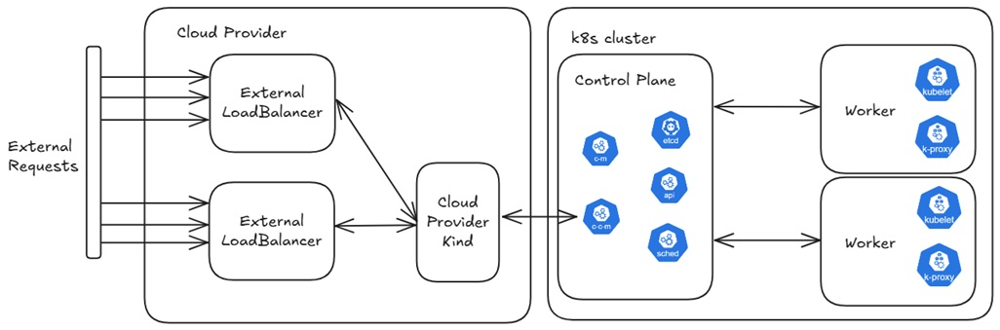

# Very kind
This repository provides an example kubernetes configuration for running a kind (kubernetes-in-docker) cluster with support for exposing services using an external IP from a docker network. The setup enables workloads inside the kind cluster to be accessible from outside the container environment without relying on cloud load balancers or metallb. It is suitable for local development and testing.

# Cluster Architecture
This approach allows applications deployed in the cluster to be reachable directly from the host machine or other containers on the same Docker network.

# Setup
1. Clone the cloud-provider-kind repository from this [link](https://github.com/kubernetes-sigs/cloud-provider-kind) and build the Docker image.
2. Provision the Kind cluster.
3. Install the ingress controller (the included script deploys HAProxy).
4. Run the cloud provider with the Docker socket mounted. The provider must be attached to the same Docker network as the Kind cluster; otherwise, the external load balancer will not be provisioned.
